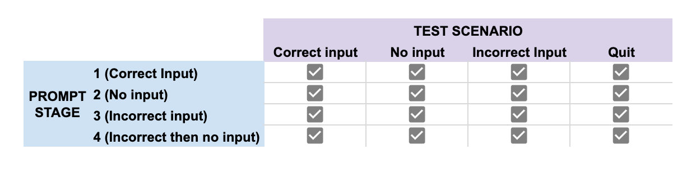

#Kreativstorm Week 3 Project: Rock Paper Scissors Game

https://seankennelly.github.io/kreativstorm-RPS-game/

## Scenarios
The code has been designed to handle the following scenarios:
* The user's input does not match game rules (ie. 'Rock', 'Paper', 'Scissors')
* The user's input is not formatted correctly (ie. 'rock', 'paPer')
* The user does not type anything before pressing OK or 'enter'
* The user's input is correct (program will run as normal)

## Testing
Due to the 4 listed scenarios above, four prompts can be reached by the user. There is potential for each scenario to be replayed in each of the four prompts. This has been tested for, with results recorded here:

